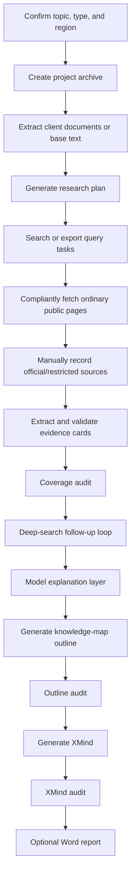

# Curation Research Skill

English | [简体中文](README_zh.md)

> A Codex / Claude Code Skill for exhibition, museum, showroom, cultural venue, theme venue, and cultural tourism pre-research. It turns a topic, client document, or public-source clue into an evidence-calibrated XMind knowledge map; when requested, it can also generate a fluent Word research report from the same evidence base.

[](LICENSE)


## What It Is

Curation Research Skill is a **knowledge-system modeling + evidence calibration** workflow for the earliest research stage of exhibition projects. It does not write curatorial themes, display formats, exhibit ideas, spatial expression, visitor experience strategies, or design proposals. Its job is earlier and more fundamental: research the subject itself, collect and explain usable material, organize the knowledge structure, and preserve enough detail for later exhibition outlines, wall texts, scripts, or content design.

The default final output is a detailed `.xmind` mind map that can be opened in XMind. The map is not a report table of contents and not a source ledger. It should read like a knowledge map for beginners: definitions, boundaries, classifications, objects, mechanisms, scenarios, timelines, data, people, policies, disputes, and sources are all expanded as visible nodes.

When the user explicitly asks for a report, Word document, `.docx`, or full delivery, the Skill can also produce a continuous Word research report based on the same evidence cards.

## Core Ideas

| Principle | Description |
| --- | --- |
| Knowledge system first | Build the subject structure before writing outputs: what it is, what it is not, how it is classified, how it works, and what objects and scenarios belong to it. |
| Evidence calibration | Hard facts such as years, people, places, data, regulations, finance, collections, and recent news must be supported by sources. |
| Encyclopedia entry points | Baidu Baike, Wikipedia, overview pages, textbooks, and introductory manuals are useful for names, aliases, terms, and classification entry points. |
| Model explanation is allowed | The model may explain concepts, connect ideas, clarify mechanisms, and polish language, but it must not invent hard facts. |
| Compliant source handling | Ordinary public web pages can be fetched by scripts. Government, regulatory, court, exchange, official database, robots-restricted, or anti-scraping pages must be read manually or in a browser, then recorded as excerpts. |
| Research only, no planning proposal | The output must not include exhibit suggestions, display forms, spatial expression, curatorial themes, core tensions, or visitor experience ideas. |

## Workflow



| Step | Output | Description |
| --- | --- | --- |
| Topic confirmation | Topic, project type, region | Determines whether the project is A/B/C/D and whether the scope is China, international, or a specific region. |
| Archive setup | Working archive | Creates folders from `00_需求文档` to `07_产出`. |
| Research plan | `research_plan.json` | Generates required cores, search dimensions, query matrices, and source ladders. |
| Search collection | `search_results.jsonl` | Uses search APIs when available, or exports query tasks for manual search. |
| Source fetching | `sources.jsonl` | Fetches allowed public pages and marks official/restricted sources as manual-required. |
| Evidence cards | `evidence_cards.jsonl` | Converts sources into verifiable factual cards with time, people, places, objects, data, source, and confidence. |
| Coverage audit | `coverage_audit.json` | Checks whether every required core has enough evidence, sources, and factual fields. |
| Research loop | `research_loop.json` | Generates second- or third-round search tasks from coverage gaps. |
| Map outline | `调研大纲.md` | Organizes evidence and explanation into a knowledge-map Markdown outline. |
| XMind | `.xmind` | Converts the Markdown outline into an XMind file with `md_to_xmind.py`. |
| Word report | `.docx` | Optional continuous research report generated from the same evidence base. |

## Project Types

| Type | Typical Topics | Required Research Focus |
| --- | --- | --- |
| A Enterprise / institution / brand | Corporate showroom, brand hall, industry pavilion, product center | Identity, organization, products, technology, customers, market, IPO, financing, valuation, revenue, orders, regulation, lawsuits, and recent updates. |
| B Museum / cultural venue / historical culture | Person museum, memorial hall, local cultural venue, literary or art venue | Life chronology, works, editions, archives, collections, inscriptions, images, travel geography, historical context, research, preservation, publication, and digitization. |
| C Cultural tourism / theme venue / themed space | Theme venue, interest-culture venue, cultural tourism experience venue, IP themed space | Subject itself, history, classifications, tools, objects, behavior, scenarios, community language, industry, consumption, policy, ethics, and recent trends. |
| D Other topics | Science venue, education venue, city/region topic, lifestyle topic, natural science topic | Determine the subject nature first, then research definitions, history, classification, mechanisms, data, institutions, policies, disputes, and recent developments. |

## Outputs

### Default Output: Knowledge-Type XMind

Formal results usually require:

- The first branch is fixed as `主题解读`.
- Maximum depth is at least 7.
- Node count is at least 400; complex subjects should be much higher.
- Note count is 0; all information must be visible as child nodes.
- No placeholders, method labels, field-prose artifacts, or curatorial contamination.
- Important concepts are expanded through multiple aspects such as definition, boundary, classification, composition, mechanism, scenario, data, and source.

### Optional Output: Research-Type Word Report

The Word report is generated only when the user explicitly asks for a report, Word document, `.docx`, or full delivery. It is not a copy of XMind nodes. It turns the same evidence into a readable, structured, fluent research report.

The report should:

- Use specific chapter titles rather than generic headings.
- Read like human-written prose, not field concatenation from evidence cards.
- Close source references naturally at the end of paragraphs, for example: `Sources consulted: Source A, Source B.`
- Explain what a number, date, policy, or file number means in context.
- Avoid exhibit ideas, display formats, spatial expression, or curatorial themes.

## Installation

### Codex / Work Buddy

```bash
git clone https://github.com/sunzhaokai95/curation-research-skill.git
mkdir -p ~/.codex/skills
cp -R curation-research-skill ~/.codex/skills/curation-research
```

You can also install it at project level:

```bash
mkdir -p .codex/skills
git clone https://github.com/sunzhaokai95/curation-research-skill.git .codex/skills/curation-research
```

Optional project instruction for `AGENTS.md`:

```text
When I ask for exhibition, museum, showroom, cultural venue, theme venue, or cultural tourism pre-research, read and strictly follow .codex/skills/curation-research/SKILL.md. Use the scripts in that Skill to generate the final .xmind file.
```

### Claude Code

```bash
git clone https://github.com/sunzhaokai95/curation-research-skill.git
mkdir -p ~/.claude/skills
cp -R curation-research-skill ~/.claude/skills/curation-research
```

## Usage

Short trigger:

```text
Please research an early-stage topic for a theme venue and output an XMind map.
```

Full delivery trigger:

```text
Please do international-view research for a corporate showroom and output both XMind and a Word report.
```

If you do not have client materials:

```text
No background documents. Start the research directly.
```

## Scripts

```text
scripts/
├── archive_init.py          # Create research archive folders
├── extract_doc.py           # Extract text from documents
├── research_plan.py         # Generate research plan
├── search_collect.py        # Search API collection or query-task export
├── fetch_sources.py         # Fetch allowed public pages; mark official/restricted pages for manual handling
├── manual_source_note.py    # Record manually/browser-read public-source excerpts
├── evidence_cards.py        # Evidence-card seed and validation
├── coverage_audit.py        # Coverage audit
├── research_loop.py         # Follow-up search planning from coverage gaps
├── outline_from_evidence.py # Draft knowledge-map outline from evidence cards
├── outline_audit.py         # Outline audit
├── md_to_xmind.py           # Convert Markdown outline to XMind
├── xmind_audit.py           # XMind audit
├── report_from_evidence.py  # Generate research report Markdown
├── report_audit.py          # Report audit
└── report_to_docx.py        # Convert report Markdown to docx
```

All scripts use only the Python 3 standard library. No `pip install` is required.

## Public Example

This repository includes anonymized public examples to show the workflow, audit metrics, and output shape. They do not include real client materials, private paths, or unauthorized project archives.

Published example:

- [Fishing Enthusiast Museum / Cultural Venue Research](docs/cases/diaoyulao-museum-zh/README.md): includes XMind, Word report, and audit summaries.

Example topic categories:

- Lifestyle / interest-culture theme venue: validates subject research, tools, behavior, community language, consumption, policy, safety, and recent updates.
- Enterprise / technology topic: validates IPO, financing, valuation, revenue, orders, regulation, lawsuits, and recent developments.
- Historical-cultural person venue: validates life chronology, works, geography, archives, collections, preservation, publication, and digitization.

## Quality Gates

| Check | Requirement |
| --- | --- |
| Knowledge entry | Encyclopedia, textbook, overview, or introductory material must be used to establish terms and classification entry points. |
| Evidence cards | Each factual claim must include `claim`, `core`, `dimension`, at least two factual-detail fields among `time/people/places/objects/data`, source, and confidence. |
| Compliant sources | Official, regulatory, government, exchange, and database sources must be read manually/browser-side and recorded; scripts must not scrape them. |
| Coverage audit | Every required core must have enough evidence and sources; no placeholder gaps. |
| Outline audit | No notes, compressed inline explanations, placeholders, method labels, field-prose artifacts, or curatorial contamination. |
| XMind audit | Node count, depth, first branch, note count, and contamination checks must pass before delivery. |
| Report audit | Character count, headings, paragraph count, short paragraphs, generic headings, and field-prose checks must pass before Word export. |

## Contributing

- Do not commit real client names, project names, contracts, or non-anonymized materials.
- When adding methodology, also add script-level audit or tests whenever possible.
- When changing report or map language rules, run:

```bash
python3 tests/test_pipeline_tools.py
```

## License

This project is released under the [MIT License](LICENSE).

## Author

Author: **Curator Sun Zhaokai**

This Skill comes from the practical need for rigorous exhibition pre-research: make source gathering more systematic, make knowledge structures clearer, and prevent later exhibition outlines from being built on vague definitions.
