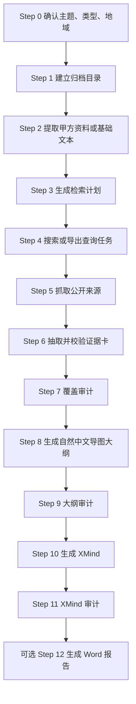

# 策展前期资料调研 Skill

> 一个面向策展、展览、展厅、主题馆、企业馆、博物馆、文化馆与文旅馆的 Codex / Claude Code Skill。它把一个主题词、甲方资料或公开资料线索,整理成可审计、可追溯、可继续深化的资料型 XMind 导图;当用户明确要求 Word / docx / 完整交付时,还会生成一份连续成文的资料调研报告。

[](LICENSE)


## 这是什么

策展前期资料调研 Skill 是一个“资料获取与事实归档”工具。它不负责写策展主题、不提供展示形式、不建议展项,也不进入空间表达。它的任务更前置:把一个主题真正研究透,把可用资料尽可能系统地搜集、拆解、归档,为后续策展大纲、展墙文案、讲解词或内容设计提供扎实底座。

默认最终成果是一份可用 XMind 打开的超详细资料型思维导图 `.xmind`。导图不是报告目录,而是资料库:每个重要事实都要能继续下钻到时间、地点、人物、对象、数据、来源和采信边界。用户明确要求“报告 / Word / docx / 完整交付”时,Skill 会在 XMind 之外,基于同一批证据卡生成资料型 Word 报告。

## 创作初衷

策展工作最容易被低估的一环,往往不是最后写主题口号,而是最开始的资料调研。很多项目看似只有一个主题,实际背后牵连着历史、人物、制度、技术、产业、地域、作品、馆藏、资本、政策、争议和最新动态。如果前期资料只停留在几句定义、几张网页摘要或一组关键词,后面的策展大纲就会变得空、薄、泛。

这个 Skill 的目标是把“调研”从模糊动作变成可检查的生产链路:先生成检索计划,再收集来源,再抽取证据卡,再做覆盖审计,最后才生成导图和报告。它尤其强调两件事:第一,资料要全、深、新,现代企业必须查资本、上市、监管和近况,历史文化主题必须查年谱、文献、作品、实物和当代研究;第二,输出语言要像给不懂该主题的人认真讲清楚,不要把证据卡字段机械拼成报告。

## 核心特性

| 特性 | 说明 |
| --- | --- |
| 证据管线先于导图 | 必须经历检索计划、搜索/来源、证据卡、覆盖审计、大纲审计、XMind 审计,避免直接按模板空写。 |
| 资料型 XMind | 默认输出 `.xmind`,所有解释、事实、数据和来源都作为可见节点,备注数目标为 0。 |
| 可选 Word 报告 | 用户要求 Word / docx / 完整交付时,基于同一批证据卡生成连续成文的资料报告。 |
| 自然中文输出 | 禁止“时间口径为”“相关人物包括”“来源类型为”等字段腔,报告和导图都必须转写成自然中文。 |
| 多类型主题适配 | 覆盖企业/机构/品牌、博物馆/文化馆/历史文化、文旅/主题馆/主题空间、其他主题。 |
| 最新资料硬要求 | 企业、科技、产业、政策、消费等主题必须查近一年、近 90 天;历史文化主题也要查最新研究、出版、保护和数字化动态。 |
| 纯 Python 标准库 | 脚本不依赖 pip,可直接用 `python3` 运行。 |

## 工作流程



| 步骤 | 产出 | 说明 |
| --- | --- | --- |
| Step 0 | 主题、类型、地域 | 判断 A/B/C/D 类型,确认国内/国际/特定地区。 |
| Step 1 | 归档目录 | 建立 `00_需求文档` 到 `07_产出` 的工作目录。 |
| Step 2 | 需求原文 | 可从 PDF/PPT/Word/TXT/MD 中提取文本。 |
| Step 3 | 检索计划 | 生成必查核心、搜索维度、查询矩阵和来源路线。 |
| Step 4 | 搜索结果 | 调用搜索 API 或导出查询任务,再由可用搜索工具补真实 URL。 |
| Step 5 | 来源文本 | 抓取公开网页文本,不绕过登录、付费或反爬。 |
| Step 6 | 证据卡 | 把来源拆成可核验事实,记录时间、人物、地点、对象、数据和来源。 |
| Step 7 | 覆盖审计 | 检查每个必查核心是否有足够证据、来源和事实字段。 |
| Step 8 | 导图大纲 | 用 `outline_from_evidence.py` 生成自然中文 Markdown 大纲。 |
| Step 9 | 大纲审计 | 检查层级、节点数、占位句、字段腔、策展污染等。 |
| Step 10 | XMind | 用 `md_to_xmind.py` 生成 `.xmind`。 |
| Step 11 | XMind 审计 | 读取 XMind 内容做最终验证。 |
| Step 12 | Word 报告 | 可选,生成 `.md` 报告、审计后转 `.docx`。 |

## 适用场景

| 类型 | 典型主题 | 必查重点 |
| --- | --- | --- |
| A 企业 / 机构 / 品牌 | 企业展厅、品牌馆、产业馆、产品中心 | 主体身份、组织结构、产品业务、技术系统、客户市场、上市/IPO、融资估值、收入订单、监管诉讼、近一年动态。 |
| B 博物馆 / 文化馆 / 历史文化 | 人物馆、纪念馆、地方文化馆、文学艺术馆 | 生平年谱、作品文献、版本注本、实物馆藏、碑刻图像、地理行旅、时代制度、研究传播、保护出版数字化。 |
| C 文旅 / 主题馆 / 主题空间 | 主题馆、兴趣文化馆、文旅体验馆、IP 主题空间 | 主题本体、历史源流、分类谱系、工具对象、行为场景、社群语言、消费产业、政策伦理、最新趋势。 |
| D 其他主题 | 科技馆、科学教育、城市地区、生活方式、自然科学 | 先判断主题属性,再补定义、历史、分类、机制、数据、机构、政策、争议和最新进展。 |

## 输出成果

### 默认成果:资料型 XMind

XMind 是本 Skill 的核心成果。它不是“简洁版汇报目录”,而是资料库式思维导图。正式结果通常要求:

- 第一分支固定为“主题解读”。
- 最大层级不低于 7。
- 节点数不低于 400,厚重主题目标更高。
- 备注节点为 0,所有资料都作为可见子节点。
- 无占位句、无方法标签、无字段腔、无策展污染。

### 可选成果:资料型 Word 报告

Word 报告只在用户明确要求报告、Word、docx 或完整交付时生成。它不是把 XMind 节点复制到文档里,而是把同一批证据卡转成逻辑分明、层级分明、句子流畅的资料报告。

报告写法强调:

- 章节像正式资料报告,不是“资料综述”“基本情况”。
- 段落像人写的中文,不是证据卡字段拼接。
- 来源放在段末自然收束,例如“以上信息综合参考:来源 A、来源 B。”
- 数据写清年份、单位、口径和来源性质。
- 不写展项、展示形式、空间表达或策展主题。

## 安装

本仓库本身就是一个 Skill 文件夹,安装后目录中应能看到 `SKILL.md`。

### Codex / Work Buddy

```bash
git clone https://github.com/sunzhaokai95/curation-research-skill.git
mkdir -p ~/.codex/skills
cp -R curation-research-skill ~/.codex/skills/curation-research
```

安装完成后的关键路径:

```text
~/.codex/skills/curation-research/SKILL.md
```

也可以放在项目级目录:

```bash
mkdir -p .codex/skills
git clone https://github.com/sunzhaokai95/curation-research-skill.git .codex/skills/curation-research
```

项目 `AGENTS.md` 中可加入:

```text
当我要求做策展/展览/展厅的前期调研、资料调研、或把某主题整理成思维导图时,读取并严格遵循 .codex/skills/curation-research/SKILL.md 的流程,用其中的 scripts/ 脚本生成 .xmind。
```

### Claude Code

```bash
git clone https://github.com/sunzhaokai95/curation-research-skill.git
mkdir -p ~/.claude/skills
cp -R curation-research-skill ~/.claude/skills/curation-research
```

安装完成后的关键路径:

```text
~/.claude/skills/curation-research/SKILL.md
```

## 使用方法

简短触发:

```text
帮我做一个某某主题馆的前期资料调研,输出 XMind。
```

完整交付触发:

```text
帮我做某某企业展厅的国际视角资料调研,输出 XMind 和 Word 报告。
```

如果没有甲方资料,可以直接说:

```text
没有资料,直接开始调研。
```

如果有资料,把 PDF/PPT/Word 放入归档目录的 `00_需求文档/`,或把官网、专题页、新闻页 URL 发给助手。

## 质量红线

| 检查项 | 要求 |
| --- | --- |
| 证据卡 | 每条事实要有 claim、core、dimension、time/people/places/objects/data 中至少 2 类细节、source 和 confidence。 |
| 覆盖审计 | 每个必查核心必须有足够证据和来源,不能用“待补”占位。 |
| 大纲审计 | 不允许备注、压缩写法、占位句、方法标签、字段腔或策展污染。 |
| XMind 审计 | 节点数、层级、第一分支、备注数、污染词全部达标后才能交付。 |
| 报告审计 | 字符数、标题数、段落数、短段落、泛化标题、字段腔全部达标后才能转 Word。 |

## 项目结构

```text
curation-research-skill/
├── SKILL.md                         # Skill 主流程、触发方式、质量红线
├── README.md                        # 中文说明文档
├── LICENSE                          # MIT License
├── .gitignore                       # Git 忽略规则
├── assets/
│   └── archive-file-template.md      # 归档说明模板
├── references/
│   ├── research-method.md            # 总方法论、证据管线、质量标准
│   ├── search-dimensions.md          # 搜索维度、查询矩阵、来源清单
│   └── mindmap-frameworks.md         # 导图母骨架、概念深挖、报告骨架
├── scripts/
│   ├── archive_init.py               # 建立调研归档目录
│   ├── extract_doc.py                # 文档转文本
│   ├── research_plan.py              # 生成检索计划
│   ├── search_collect.py             # 搜索 API 或查询任务导出
│   ├── fetch_sources.py              # 抓取公开来源文本
│   ├── evidence_cards.py             # 证据卡种子与校验
│   ├── coverage_audit.py             # 覆盖审计
│   ├── outline_from_evidence.py      # 证据卡转自然中文导图大纲
│   ├── outline_audit.py              # 大纲审计
│   ├── md_to_xmind.py                # Markdown 大纲转 XMind
│   ├── xmind_audit.py                # XMind 审计
│   ├── report_from_evidence.py       # 证据卡转资料报告 Markdown
│   ├── report_audit.py               # 报告审计
│   └── report_to_docx.py             # 报告 Markdown 转 docx
└── tests/
    └── test_pipeline_tools.py        # 关键脚本回归测试
```

## 常见问题 FAQ

| 问题 | 回答 |
| --- | --- |
| 是否需要 pip 安装依赖？ | 不需要。脚本只使用 Python 3 标准库。 |
| 没有搜索 API 能用吗？ | 可以。`search_collect.py` 会导出查询任务,再由可用搜索工具或人工搜索补真实 URL。 |
| 它会写策展方案吗？ | 不会。这个 Skill 只做前期资料获取与事实归档,不写展项、展示形式、空间方案或策展主题。 |
| 为什么默认只交 XMind？ | 策展前期资料最需要保留颗粒度。XMind 更适合承载多层事实、来源和数据。Word 只在用户明确要求完整交付时生成。 |
| Word 报告和 XMind 是两套资料吗？ | 不是。二者都来自同一批证据卡。XMind 保留颗粒度,Word 负责连续阅读。 |
| 可以直接用历史文化主题吗？ | 可以,但必须查生平年谱、作品文献、实物馆藏、研究传播和当代保护/出版/数字化动态。 |
| 可以直接用企业主题吗？ | 可以,但必须查上市/IPO、融资估值、收入订单、监管诉讼、近一年和近 90 天动态。 |

## 贡献指南

欢迎提交改进建议与 PR。请注意:

- 不要提交真实甲方项目名称、客户资料、合同文件或未脱敏案例。
- 新增方法论时,要同步补充脚本审计或测试,避免只增加提示词。
- 修改报告或导图语言规则时,请运行 `python3 tests/test_pipeline_tools.py`。

## 许可证

本项目基于 [MIT License](LICENSE) 开源。

## 作者

作者: **策展人 孙兆楷**

这个 Skill 来自策展前期调研工作的实际需求:让资料获取更系统,让证据链更清楚,也让后续策展大纲不再建立在几句空泛定义上。
