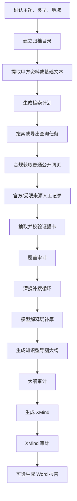

# 策展前期资料调研 Skill

[English](README.md) | 简体中文

> 面向策展、展览、展厅、主题馆、企业馆、博物馆、文化馆与文旅馆的 Codex / Claude Code Skill。它把一个主题词、甲方资料或公开资料线索,整理成可审计、可追溯、可继续深化的知识型 XMind 导图;当用户明确要求 Word / docx / 完整交付时,还会生成一份连续成文的资料调研报告。

[](LICENSE)


## 这是什么

策展前期资料调研 Skill 是一个“知识系统建模 + 证据校准”工具。它不负责写策展主题、不提供展示形式、不建议展项,也不进入空间表达。它的任务更前置:把一个主题真正研究透,把可用资料尽可能系统地搜集、解释、拆解、归档,为后续策展大纲、展墙文案、讲解词或内容设计提供扎实底座。

默认最终成果是一份可用 XMind 打开的超详细资料型思维导图 `.xmind`。导图不是报告目录,也不是来源流水账;它要像一套给小白也能读懂的知识地图,把定义、边界、分类、对象、机制、场景、时间线、数据、人物、政策、争议和来源都展开到可见节点中。用户明确要求“报告 / Word / docx / 完整交付”时,Skill 会在 XMind 之外,基于同一批资料生成资料型 Word 报告。

## 核心思想

| 原则 | 说明 |
| --- | --- |
| 知识系统先行 | 先建立主题是什么、不是什么、怎么分类、如何运作、有什么对象与场景的知识结构。 |
| 证据校准托底 | 年份、人物、地点、数据、法规、财务、馆藏、最新新闻等硬事实必须有来源支撑。 |
| 百科入口必查 | 百度百科、维基百科、百科概览、教材和入门手册用于建立名称、别名、术语和分类入口。 |
| 模型解释可用 | 大模型可用于小白解释、机制说明、术语关系、章节衔接和语言润色,但不能虚构硬事实。 |
| 合规来源获取 | 普通公开网页可由脚本获取;政府、监管、法院、交易所、官方数据库、robots 禁止或反爬页面只允许人工/浏览器读取后记录摘录。 |
| 只做资料不做方案 | 不写展项、展示形式、空间表达、策展主题、核心张力或观众体验建议。 |

## 工作流程



| 步骤 | 产出 | 说明 |
| --- | --- | --- |
| 主题确认 | 主题、类型、地域 | 判断 A/B/C/D 类型,确认国内/国际/特定地区。 |
| 建档 | 归档目录 | 建立 `00_需求文档` 到 `07_产出` 的工作目录。 |
| 检索计划 | `research_plan.json` | 生成必查核心、搜索维度、查询矩阵和来源路线。 |
| 搜索收集 | `search_results.jsonl` | 调用搜索 API 或导出查询任务,再补真实 URL。 |
| 来源获取 | `sources.jsonl` | 普通网页自动获取;官方/受限页面人工摘录。 |
| 证据卡 | `evidence_cards.jsonl` | 把来源拆成可核验事实,记录时间、人物、地点、对象、数据和来源。 |
| 覆盖审计 | `coverage_audit.json` | 检查每个必查核心是否有足够证据、来源和事实字段。 |
| 深搜循环 | `research_loop.json` | 根据覆盖缺口生成二轮/三轮补搜任务。 |
| 导图大纲 | `调研大纲.md` | 把证据和模型解释组织成知识型 Markdown 大纲。 |
| XMind | `.xmind` | 用 `md_to_xmind.py` 生成可打开的 XMind 文件。 |
| Word 报告 | `.docx` | 可选,生成连续成文的资料报告。 |

## 适用场景

| 类型 | 典型主题 | 必查重点 |
| --- | --- | --- |
| A 企业 / 机构 / 品牌 | 企业展厅、品牌馆、产业馆、产品中心 | 主体身份、组织结构、产品业务、技术系统、客户市场、上市/IPO、融资估值、收入订单、监管诉讼、近一年动态。 |
| B 博物馆 / 文化馆 / 历史文化 | 人物馆、纪念馆、地方文化馆、文学艺术馆 | 生平年谱、作品文献、版本注本、实物馆藏、碑刻图像、地理行旅、时代制度、研究传播、保护出版数字化。 |
| C 文旅 / 主题馆 / 主题空间 | 主题馆、兴趣文化馆、文旅体验馆、IP 主题空间 | 主题本体、历史源流、分类谱系、工具对象、行为场景、社群语言、消费产业、政策伦理、最新趋势。 |
| D 其他主题 | 科技馆、科学教育、城市地区、生活方式、自然科学 | 先判断主题属性,再补定义、历史、分类、机制、数据、机构、政策、争议和最新进展。 |

## 输出成果

### 默认成果:知识型 XMind

正式结果通常要求:

- 第一分支固定为“主题解读”。
- 最大层级不低于 7。
- 节点数不低于 400,厚重主题目标更高。
- 备注节点为 0,所有资料都作为可见子节点。
- 无占位句、无方法标签、无字段腔、无策展污染。
- 每个重要概念至少有定义、边界、分类、组成、机制、场景、数据、来源等多个展开面。

### 可选成果:资料型 Word 报告

Word 报告只在用户明确要求报告、Word、docx 或完整交付时生成。它不是把 XMind 节点复制到文档里,而是把同一批资料转成逻辑分明、层级分明、句子流畅的资料报告。

报告写法强调:

- 章节像正式资料报告,不是空泛标题。
- 段落像人写的中文,不是证据卡字段拼接。
- 来源放在段末自然收束,例如“以上信息综合参考:来源 A、来源 B。”
- 数据写清年份、单位、口径和来源性质。
- 不写展项、展示形式、空间表达或策展主题。

## 安装

### Codex / Work Buddy

```bash
git clone https://github.com/sunzhaokai95/curation-research-skill.git
mkdir -p ~/.codex/skills
cp -R curation-research-skill ~/.codex/skills/curation-research
```

也可以放在项目级目录:

```bash
mkdir -p .codex/skills
git clone https://github.com/sunzhaokai95/curation-research-skill.git .codex/skills/curation-research
```

项目 `AGENTS.md` 中可加入:

```text
当我要求做策展/展览/展厅的前期调研、资料调研、或把某主题整理成思维导图时,读取并严格遵循 .codex/skills/curation-research/SKILL.md 的流程,用其中的 scripts/ 脚本生成 .xmind。
```

### Claude Code

```bash
git clone https://github.com/sunzhaokai95/curation-research-skill.git
mkdir -p ~/.claude/skills
cp -R curation-research-skill ~/.claude/skills/curation-research
```

## 使用方法

简短触发:

```text
帮我做一个某某主题馆的前期资料调研,输出 XMind。
```

完整交付触发:

```text
帮我做某某企业展厅的国际视角资料调研,输出 XMind 和 Word 报告。
```

如果没有甲方资料,可以直接说:

```text
没有资料,直接开始调研。
```

## 脚本清单

```text
scripts/
├── archive_init.py          # 建立调研归档目录
├── extract_doc.py           # 文档转文本
├── research_plan.py         # 生成检索计划
├── search_collect.py        # 搜索 API 或查询任务导出
├── fetch_sources.py         # 合规获取普通公开网页,官方/受限来源转人工记录
├── manual_source_note.py    # 记录人工/浏览器读取的公开来源摘录
├── evidence_cards.py        # 证据卡种子与校验
├── coverage_audit.py        # 覆盖审计
├── research_loop.py         # 覆盖缺口深搜补搜
├── outline_from_evidence.py # 证据卡转知识型导图大纲底稿
├── outline_audit.py         # 大纲审计
├── md_to_xmind.py           # Markdown 大纲转 XMind
├── xmind_audit.py           # XMind 审计
├── report_from_evidence.py  # 资料报告 Markdown
├── report_audit.py          # 报告审计
└── report_to_docx.py        # 报告 Markdown 转 docx
```

脚本只使用 Python 3 标准库,无需 pip 安装。

## 示例案例

仓库会保留脱敏的公开示例说明,用于展示流程、审计指标和输出形态。示例不包含真实客户资料、私有路径或未授权项目归档。

已公开案例:

- [钓鱼佬博物馆 / 文化馆资料调研](docs/cases/diaoyulao-museum-zh/README.md):包含 XMind、Word 报告和审计摘要。

可公开示例主题:

- 生活方式/兴趣文化主题馆:用于验证“主题本体、工具对象、行为流程、社群语言、产业消费、政策安全、最新动态”的完整展开。
- 企业/科技主题:用于验证“上市/IPO、融资估值、收入订单、监管诉讼、近一年动态”的硬性覆盖。
- 历史文化人物馆:用于验证“生平年谱、作品文献、地理行旅、实物馆藏、当代保护出版数字化”的硬性覆盖。

## 质量红线

| 检查项 | 要求 |
| --- | --- |
| 知识入口 | 百科、教材、综述或入门资料必须用于建立术语和分类入口。 |
| 证据卡 | 每条事实要有 claim、core、dimension、time/people/places/objects/data 中至少 2 类细节、source 和 confidence。 |
| 合规来源 | 官方/监管/政府/交易所/数据库类来源只人工读取记录,不脚本抓取。 |
| 覆盖审计 | 每个必查核心必须有足够证据和来源,不能用“待补”占位。 |
| 大纲审计 | 不允许备注、压缩写法、占位句、方法标签、字段腔或策展污染。 |
| XMind 审计 | 节点数、层级、第一分支、备注数、污染词全部达标后才能交付。 |
| 报告审计 | 字符数、标题数、段落数、短段落、泛化标题、字段腔全部达标后才能转 Word。 |

## 贡献指南

- 不要提交真实甲方项目名称、客户资料、合同文件或未脱敏案例。
- 新增方法论时,要同步补充脚本审计或测试,避免只增加提示词。
- 修改报告或导图语言规则时,请运行 `python3 tests/test_pipeline_tools.py`。

## 许可证

本项目基于 [MIT License](LICENSE) 开源。

## 作者

作者: **策展人 孙兆楷**

这个 Skill 来自策展前期调研工作的实际需求:让资料获取更系统,让知识结构更清楚,也让后续策展大纲不再建立在几句空泛定义上。
